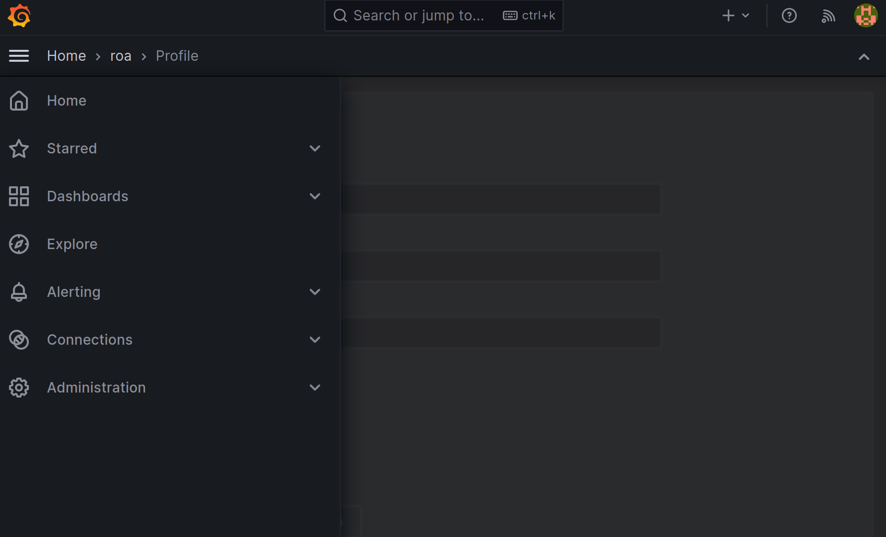
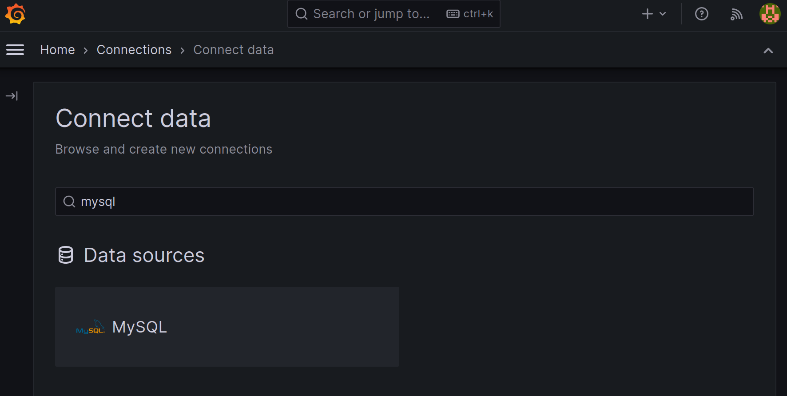
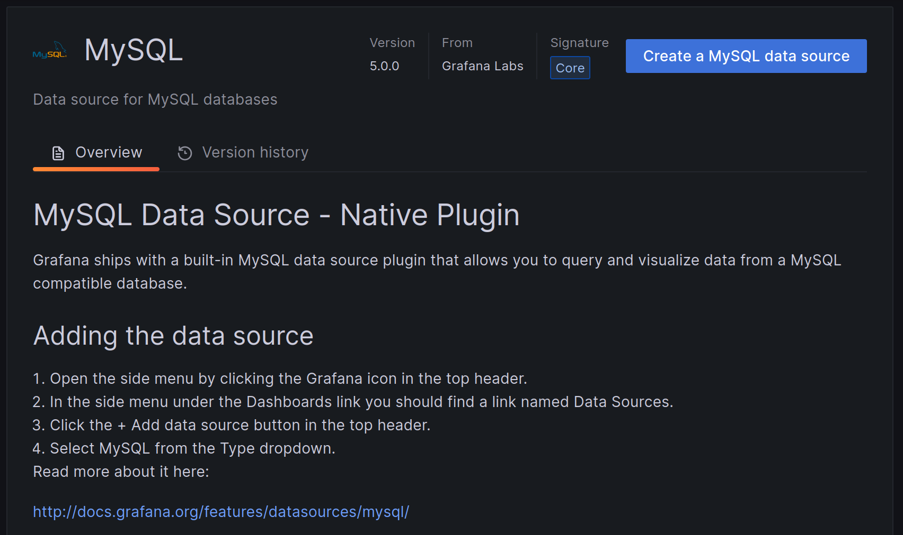
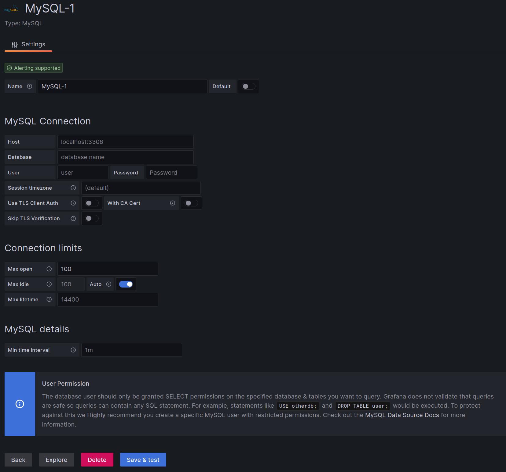
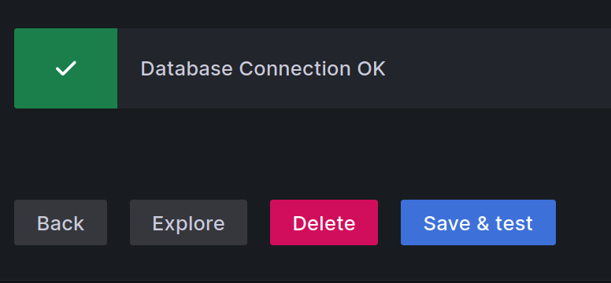
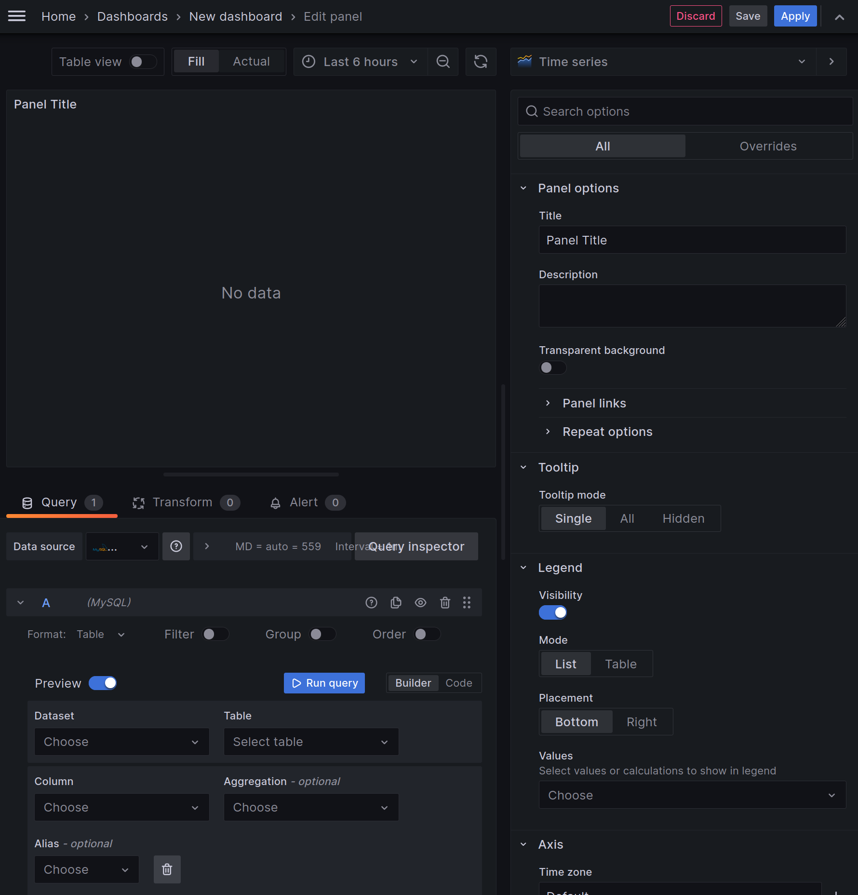
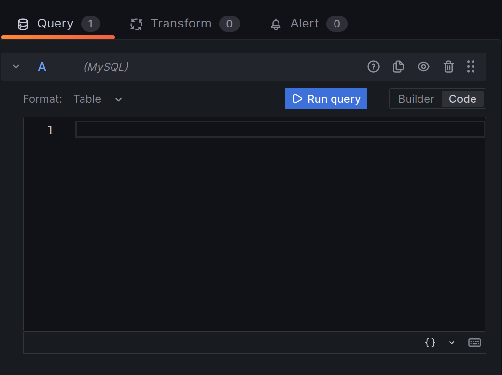
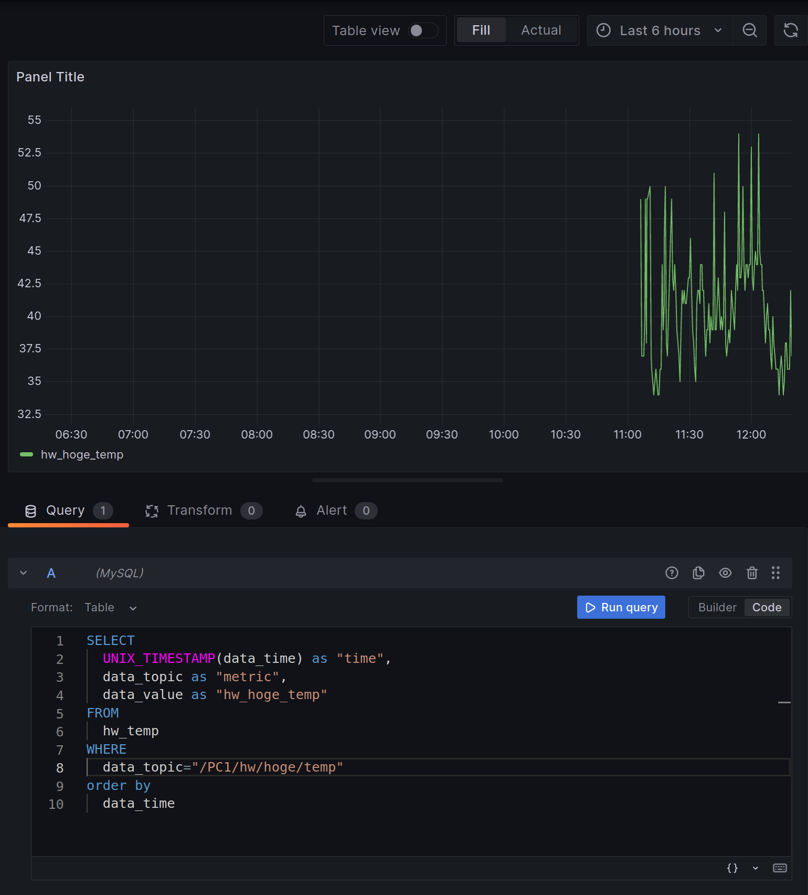

# simple_monitoring_system/Grafana
簡易モニタリングシステムのgrafana server

## General Settings

1. grafanaのインストール([README.md](../README.md)参照)
2. ブラウザでアクセス(IP:3000)
3. ログイン(初期usernameとpasswordはadmin)
4. usernameとpasswordを変更する
   - 右上のアカウントマーク->profile
   - 右上のアカウントマーク->change password

## Data Source Setting
1. 左のメニューからconnectionsを選択
   
2. mysqlで検索をして、MySQLを選択
    
3. Create a mysql data sourceをクリック
   
4. Host, Database, User, Passwordを入力し、下部のSave & testをクリック
   
5.  データベースに接続がてきていればこのようになる
    

## Make Dashbord
1. 左のメニューからDashboardsを選択
   
2. New -> New Dashboard -> Add visualizationを選択すると、ダッシュボードの編集画面にたどり着く
   
3. 左下のQueryタブの中のBuilderをCodeに変える。
   
4. あとはここに以下のようにコードを入れるだけ
   

for hardware temp
```sql
SELECT
  UNIX_TIMESTAMP(data_time) as "time",
  data_topic as "metric",
  data_value as "hw_hoge_temp"
FROM 
  hw_temp
WHERE
  data_topic="/PC1/hw/hoge/temp"
order by
  data_time
```

for memory use rate
```sql
SELECT
  UNIX_TIMESTAMP(data_time) as "time",
  data_topic as "metric",
  data_value as "mem_use_rate"
FROM 
  mem_use_rate
WHERE
  data_topic="/PC1/mem/rate"
order by
  data_time
```

## Author
[sudo-roa](https://github.com/sudo-roa)