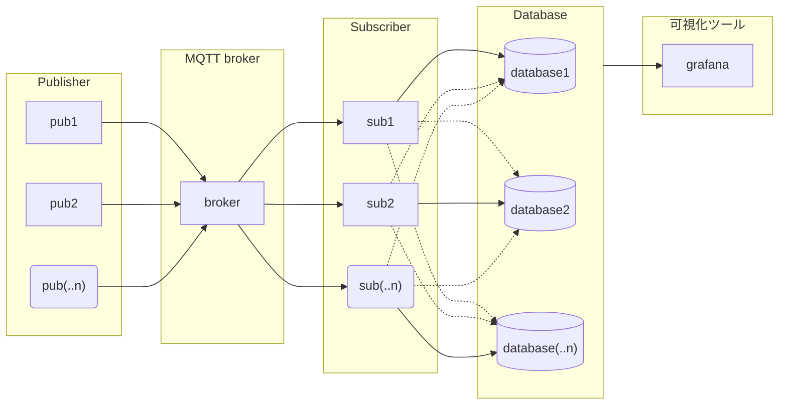
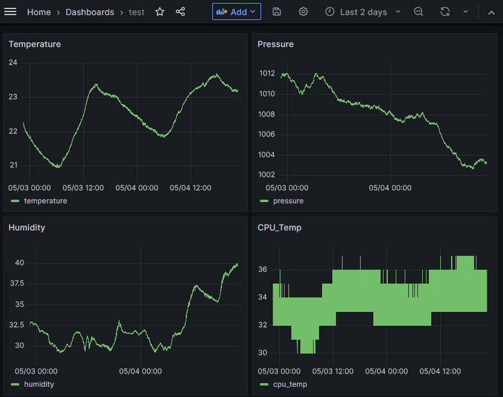

のんびり更新していきます～

# simple_monitoring_system
mqtt, sql,可視化ツールを利用した簡易モニタリングシステム

## Overview
各種IoTデバイス等のデータをmqttプロトコルで受け渡し、そのデータをデータベース内に保存。
保存されたデータを可視化ツール上でグラフ化するもの。
コードは、データのパブリッシュ・サブスクライブ、データベースへのデータ追加、grafanaへのデータ表示を一通り行えるものになります。
IoTシステムの簡単な流れをつかむくらいはできる気がする…。
> ※ マイコン等を使ったデータ収集部分はありません。

### System outline
フローチャートですが…こんな感じでデータが流れていきます。

| 項　目 | 説　明 |
|:-|:-:|
| Publisher | mqttクライアントとしてデータを送信するデバイス<br>もしくはそのプロセス|
| Broker | mqttブローカー |
| Subscriber | mqttクライアントとしてデータを受信するデバイス<br>もしくはそのプロセス |
| Database | 各種データの保管場所としてのDatabase<br>SQLでもJSONでもテキストでも |
| 可視化ツール | 時系列データを表等にしてくれるツール<br>いわゆるBIツール、ダッシュボードツールと言われるもの |

## Tools
あくまで自分が使った時のバージョンなので、別バージョンだと動かないということはないと思います。このバージョンなら動く確認取れてますよってことです。
- mqtt
  - mosquitto 2.0.11
  - paho-mqtt 1.6.1
- sql
  - MySQL 8.0.32-0ubuntu0.22.04.2
  - pymysql 1.0.3
- 可視化ツール
  - grafana 9.5.1
- python 3.10.6
  - python-dotenv 1.0.0

## Demo
grafanaでの可視化の様子
<br>

## Install
リポジトリ内のコードを動かすための各種ツールのインストール方法

### for Publisher(MQTT client)
Publisherディレクトリで以下のコマンド
- ubuntu
  ```
  $ python3 -m venv venv
  $ source venv/bin/activate
  $ pip install -r requirements.txt
  ```

### for Broker(MQTT server)
- ubuntu
  ```
  $ sudo apt install mosquitto
  ```
- windows
  <br>windowsは[こちらからダウンロード](https://mosquitto.org/download/)

### for Subscriber(MQTT client)
Subscriberディレクトリで以下のコマンド
```
$ python3 -m venv venv
$ source venv/bin/activate
$ pip install -r requirements.txt
```

### for Database server
- ubuntu
  ```
  $ sudo apt install mysql-server
  ```

### for grafana server
- ubuntu
  <br>grafanaのインストールは[こちら](https://grafana.com/docs/grafana/latest/setup-grafana/installation/debian/)から

- dockerを使う場合
  ```
  $ docker run -d --name=grafana -p 3000:3000 grafana/grafana
  ```
  http://localhost:3000でgrafanaに接続できるようになります。
  - 初期UserName : admin
  - 初期Password : admin

## Settings
各ディレクトリのREADME.mdを参照してください。
Brokerのみここで説明しています。
### for Publisher(MQTT client)
Publisherディレクトリの[README.md](./Publisher/README.md)を参照

### for Broker(MQTT server)
local onlyモードの解除方法

### for Subscriber(MQTT client)
Subscriberディレクトリの[README.md](./Subscriber/README.md)を参照

### for Database server
Databaseディレクトリの[README.md](./Database/README.md)を参照

### for grafana server
Grafanaディレクトリの[README.md](./Grafana/README.md)を参照

## Usage
上記[Settings](#settings)の項目同様に各ディレクトリのREADME.mdを参照してください。
Brokerのみここで説明しています。
### Broker
起動の確認
```
  $ sudo systemctl status mosquitto.service
```
ダウンロードした時点で勝手に起動してるはず…なので特にやることはありません。

## Reference
- [pymysql](https://pypi.org/project/pymysql/)
- [paho-mqtt](https://pypi.org/project/paho-mqtt/)
- [python-dotenv](https://pypi.org/project/python-dotenv/)
- [grafana docs](https://grafana.com/docs/?plcmt=learn-nav)

## Licence
[MIT Licence](./LICENSE)

## Author
[sudo-roa](https://github.com/sudo-roa)
